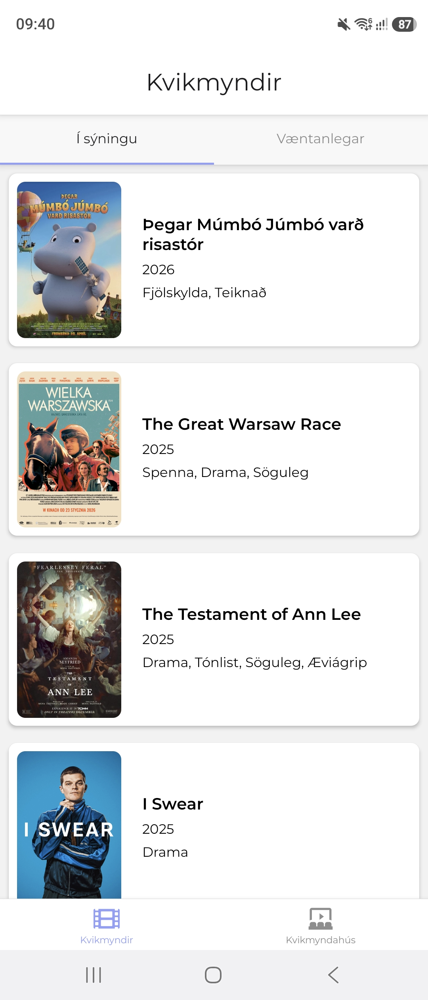
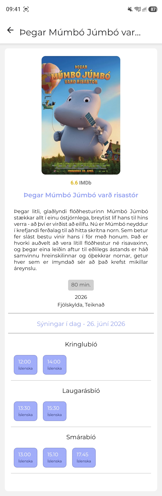
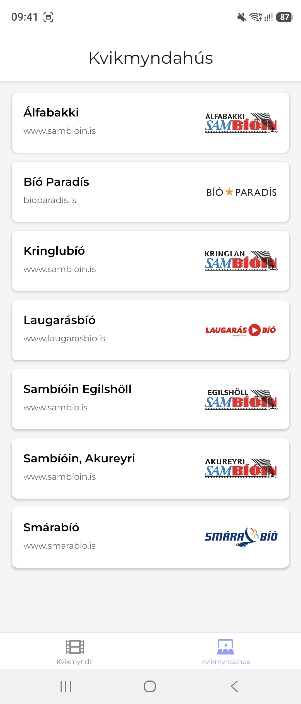
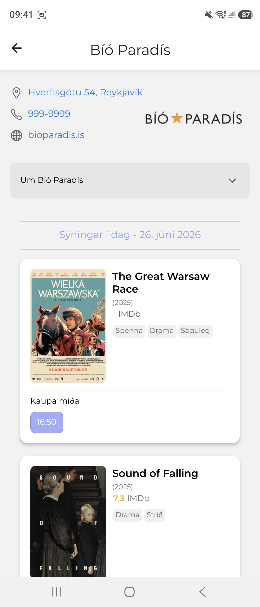

# Group 1

The project was tested using Android operation system.

## Members:

- Georgia Maltsaki
- Guðrún Elín Guðmundsdóttir
- Mateusz Fiolna

# Project Name

    # DR CINEMA #

## Description

    A movie theater application that lets you see the movies that are showing or upcoming for the cinemas in Iceland, as well as a list of all cinemas. There is also a detailed movie page, where you can find information about the movie you have slected along with time slots for the day that you can click to go a ticket purching page.
    Under the detailed cinema page you can see all relevent information on the selected cinema as well movies showing at that time.

## Screens

  
  
  
  

## Table of Contents

    -	Running the App
    -	Technologies Used
    -	Platform Support
    -	Setup Instructions
    -	Known Issues

## Running the app

    Create an account on https://api.kvikmyndir.is/.
    When that is done, add your username and password to the conifg.js file in the cinema directory.

### Navigate to project directory

`cd cinema`

### Install dependencies

`npm install`

### Running the App

`npm start`

## Platform Support

### Primary Development Platform

    -	Primary Platform: Android
    -	Test Device: Samsung Galaxy S23 Ultra
    -	OS Version: Android 14

## Requirements & Extras

- All requirements and extras have been implemented and are functional!
